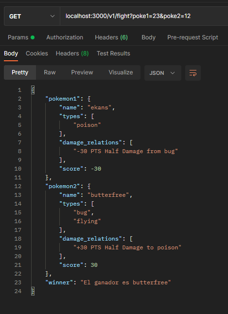

# HannPoke-Api

## DESCRIPTION
This is my personal `POKEMON GYM`, where all the battles are 1vs1 type, you can face your pokemons and see according to its type, if it wins or loses.

### HOW TO RUN IT...
Be sure that you have you NodeJs env Installed, FMI visit [nodejs.org](https://nodejs.org/es/).

OPEN YOUR `CLI` ON A NEW FOLDER AND...

- Clone the Repo

```
git clone https://github.com/HannPark/HannPoke-Api.git 
```
- Get into the folder
```
cd HannPoke-Api
```
- Install dependencies
```
npm install
```

- and RUN IT
```
npm start
```
### HOW TO USE IT...

Make a GET request to the address `localhost:3000/v1/fight`, with the parameters:

- `poke1`: Name or ID of the first pokemon
- `poke2`: Name or ID of the second one 

Here´s an Example with Poke'ID: 
```
GET - localhost:3000/v1/fight?poke1=23&poke2=12
```
and with PokeNames:
```
GET - localhost:3000/v1/fight?poke1=bulbasaur&poke2=charmeleon
```

This is an example of a POSTMAN's Response:



### DISCLAIMER
- In order to get the data of the existing 898 pokemons, this API consumes the data coming from [pokeapi.co](https://pokeapi.co/).
- This API keeps track of all queried fights in a public [Mongo Atlas](https://www.mongodb.com/atlas/database), because I just like it.

### License

MIT